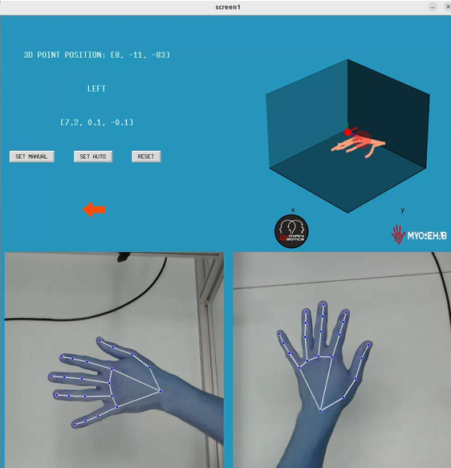

# Estimación de pose de una mano en 3D para MyOreHab

## Descripción del Proyecto

**3DHandEstimation** es un proyecto diseñado para desarrollar un sistema de estimación de la mano en 3D utilizando dos cámaras. El objetivo es detectar la mano en tiempo real, estimar su posición tridimensional y proporcionar retroalimentación visual y auditiva al usuario para guiarlo hacia un punto establecido. El proceso comenzó con una investigación sobre técnicas de visión por computadora y calibración de cámaras, seguida de la modificación de un script de calibración para manejar la captura de frames y recalibración. La estimación de los puntos de interés de la mano se realizó con MediaPipe, y los datos se triangularon en 3D usando Matplotlib para su visualización. Se desarrolló una interfaz con Tkinter que muestra las cámaras en tiempo real con OpenCV y actualiza una figura 3D para la mano estimada. La interfaz incluye botones para establecer y resetear puntos, y proporciona retroalimentación visual y auditiva: flechas para guiar la mano, distancia al punto objetivo, y sonidos que indican la proximidad. Finalmente, el programa se convirtió en un ejecutable, mejorando la interfaz visual, añadiendo alertas y almacenando automáticamente el punto objetivo en un archivo TXT.

## Estructura del Proyecto

El proyecto se divide en dos scripts principales, un archivo para los parámetros de calibración de las cámaras y 5 directorios:

1. **Calibración de cámaras**:
   - **Descripción**: Script para la calibración y sincronización de cámaras.
   - **Script**: `calib.py`
   - **Créditos**: [Stereo Camera Calibration and Triangulation with OpenCV and Python](https://temugeb.github.io/opencv/python/2021/02/02/stereo-camera-calibration-and-triangulation.html)

2. **Estimación de la mano**:
   - **Descripción**: Script de la interfaz para la estimación y triangulación de la mano con indicaciones visuales y auditivas para el paciente.
   - **Script**: `interface.py`
   - **Tutorial**: [Real time 3D hand pose estimation using Mediapipe](https://temugeb.github.io/python/computer_vision/2021/06/27/handpose3d.html)

3. **Parámetros de calibración**:
   - **Descripción**: Ajustes de los parámetros de calibración de las cámaras.
   - **Archivo**: `calibration_settings.yaml`

4. **Directorios de interés**:
   - **Carpetas**:
     - `camera_parameters`: Archivos txt con los parámetros de calibración de las cámaras.
     - `files`: Imágenes empleadas en la interfaz.
     - `frames`: Imágenes tomadas individualmente por cada una de las cámaras.
     - `frames_pair`: Imágenes tomadas a la par para la triangulación de las cámaras.
     - `images`: Imágenes guía para la estimación del origen del espacio 3D.
  
## Técnicas Utilizadas

- **Calibración de Cámaras**:
  - **Calibración de Cámara**: Técnica para corregir distorsiones en las imágenes capturadas por las cámaras y asegurar una medición precisa en el espacio tridimensional.
  - **Método de Chessboard**: Utilización de un patrón de tablero de ajedrez para la calibración, con ajustes realizados en el script de calibración de cámaras.

- **Estimación de Puntos de Interés**:
  - **Detección de Mano con MediaPipe**: Técnica de aprendizaje automático para detectar puntos clave en la mano a partir de imágenes en tiempo real.

- **Triangulación 3D**:
  - **Triangulación Estéreo**: Técnica para calcular la posición 3D de los puntos de interés de la mano utilizando las imágenes capturadas por las dos cámaras.

- **Visualización**:
  - **Visualización en 3D con Matplotlib**: Técnica para representar gráficamente la posición estimada de la mano en un espacio tridimensional.
  - **Interfaz Gráfica con Tkinter**: Creación de una interfaz gráfica que muestra las imágenes de las cámaras y la representación 3D de la mano, así como retroalimentación visual y auditiva.

- **Retroalimentación al Usuario**:
  - **Retroalimentación Visual**: Uso de flechas y marcadores en la interfaz para guiar al usuario hacia el punto objetivo.
  - **Retroalimentación Auditiva**: Implementación de sonidos que indican la distancia al objetivo para proporcionar una guía adicional al usuario.

- **Empaquetado y Distribución**:
  - **Conversión a Archivo Ejecutable**: Transformación del script Python en un archivo ejecutable para facilitar la ejecución del programa en sistemas sin necesidad de un entorno de desarrollo.

## Requisitos

- **OpenCV**: Para captura y procesamiento de imágenes en tiempo real.
- **MediaPipe**: Para la detección de puntos de interés en la mano.
- **Matplotlib**: Para la visualización de datos en 3D.
- **Tkinter**: Para la creación de la interfaz gráfica de usuario.
- **NumPy**: Para cálculos numéricos y procesamiento de datos.

## Imágen de la interfaz en funcionamiento

## Licencia

Este proyecto está licenciado bajo la [MIT License](LICENSE).

## Contacto

Para cualquier consulta sobre este proyecto, puedes contactar a través de [limortesantiago@gmail.com].
- **Desarrollador**: [Santiago Limorte](https://www.linkedin.com/in/limortesantiago/)

